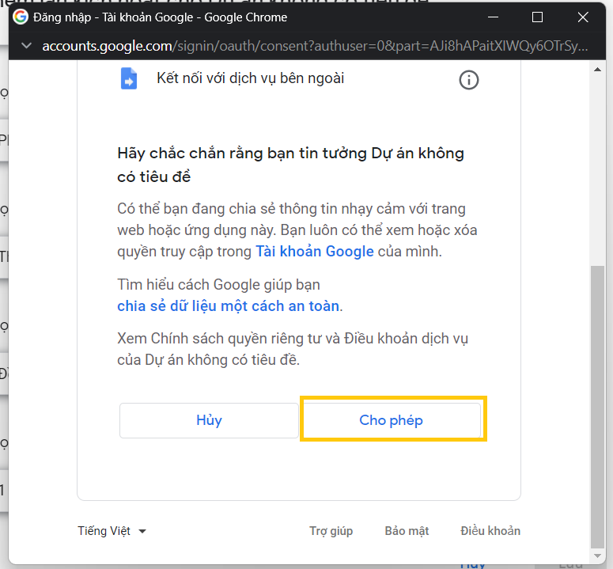

# Auto check mail Moodle

For more documentation on the use of the Moodle apisee the [Moodle api - documentation](https://docs.moodle.org/dev/Web_service_API_functions)

## How to implement
Đầu tiên, chúng ta cần lấy một số thông tin của tài khoản (access token, user id, mail token)
### Step 1: Get your information
Đầu tiên, chúng ta cần lấy một số thông tin của tài khoản (access token, user id, mail token)
#### Access token
Vào Trang chủ của trường  -> Nhấn vào biểu tượng trên góc phải -> Tùy Chọn


Trong phần Tùy chọn -> chọn security keys


Lấy hàng đầu tiên của cột key


#### User id
Vào Trang chủ của trường  -> Nhấn vào biểu tượng trên góc phải -> Hồ sơ


Trên thanh địa chỉ chúng ta sẽ thấy userid gồm 6 chữ số


#### Email token
Truy cập link https://postmail.invotes.com/

Nhập mail vào “Your contact email” -> Go 

__Chú ý: mail nhập vào sẽ là mail mà bạn muốn nhận tin nhắn từ hệ thống khi có tin nhắn mới từ el.__


Check mail mà bạn vừa đăng kí sẽ nhận được 1 mail mới với nội dung


Note lại phần mail access token này.
### Step 2: Built Google Script
Truy cập https://www.google.com/script/start/ -> Start Script


Chọn tạo dự án mới


Copy + Paste code vào dự án như hình -> điền 3 tham số là 3 thông tin vừa thu thập ở trên -> Ctrl + S để lưu dự án
```
    const token = 'a964c82f48069bcea5470b067d8f3'
    const userid = 1234567
    const mail_token = 'rqtx4443dlmmnlkxmh4u2'
```


Chọn vào phần kích hoạt trong các mục phía bên trái


Chọn tiếp thêm trình kích hoạt ở góc phải phía dưới


Trong hộp thoại hiện ra, chỉnh các thông tin như hình -> nhấn “Lưu”:


Chọn email bạn đang dùng để chạy dự án google script:


Cửa sổ mới hiện ra chọn Nâng cao


Chọn đi tới dự án không an toàn (vì đây là dịch vụ của google và code do chúng ta tự tạo ra nên các bạn không cần lo lắng vấn đề bảo mật nữa)


Trong cửa sổ kế tiếp ta kéo xuống và nhấn vào nút “Cho Phép”:



Và vậy là chúng ta đã hoàn thành hệ thống tự động


Khi có tin nhắn trên hệ thống el


Chúng ta sẽ nhận được mail 


### Step 3: Stop implement
Khi muốn xóa dự án chúng ta đến phần thi hành chọn Xóa vĩnh viễn


### Lỗi thường gặp
Trong quá trình chạy đôi khi sẽ gặp lỗi quá hạn mức băng thông được báo về mail (như hình dưới) nhưng nó sẽ chỉ ảnh hưởng đến 1 lệnh đó mà không ảnh hưởng đến cả dự án.

